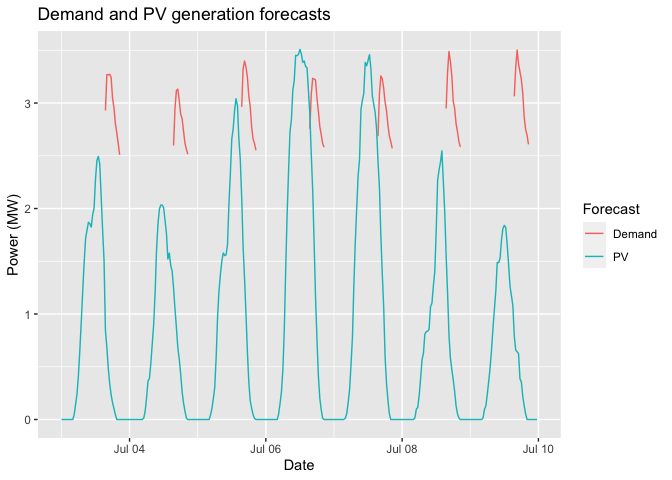
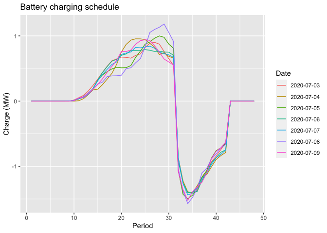
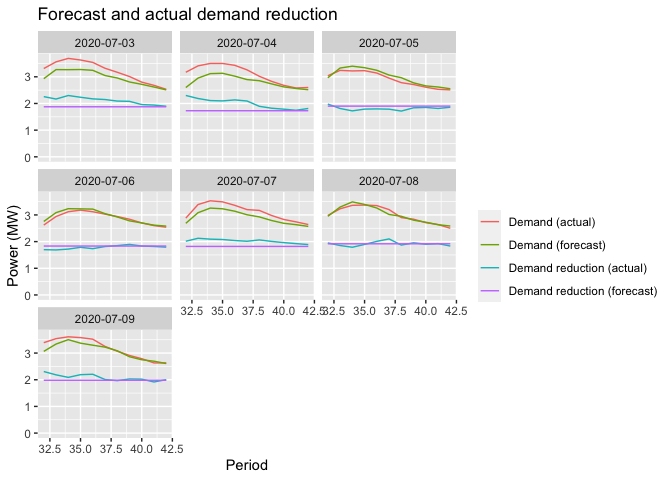

<!-- README.md is generated from README.Rmd. Edit and knit README.Rmd to update README.md. -->

# Presumed Open Data Energy Challenge

This is the code used by the winning team “Cameron” in the Presumed Open
Data Data Science Challenge. The challenge focused on scheduling battery
charging to ensure most charging used energy from PV generation and
discharging was scheduled so as to minimise peak demand in the evening.
Team Cameron finished in first place at the conclusion of the
competition.

## Installation

To install the `podEnergyComp` library in this repository, run the
following code.

``` r
install.packages("devtools")
devtools::install_github("camroach87/pod-energy-comp")
```

## Tuning demand and PV models

**TODO:** The `cv_ts_folds` function was incredibly useful when tuning
the `num_leaves` and `learning_rate` hyperparameters. I’ll add a short
demonstration soon.

## Producing a battery schedule

Here is an example of how I produced the forecasts for the final round
of the competition.

``` r
library(podenergycompdenmark)
library(tidyverse)
library(lubridate)

fcst_start_date <- ymd("2019-12-26")

# predict PV and demand
demand.data <- load_demand_data()
demand.cv <- cv_ts_folds(demand.data$datetime,
                         start_date = fcst_start_date,
                         horizon = 7, 
                         iterations = 1)
demand.forecast <- pred_demand(
  select(demand.data, -datetime),
  demand.cv[[1]]$train,
  demand.cv[[1]]$test,
  nrounds = 500L,
  num_leaves = 10L,
  learning_rate = 0.1,
  obj = "regression",
  metric = "regression"
)

pv.data <- load_pv_data()
pv.cv <- cv_ts_folds(pv.data$datetime, 
                     start_date = fcst_start_date,
                     horizon = 7, 
                     iterations = 1)
pv.forecast <- pred_pv_quantile(
  pv.data,
  pv.cv[[1]]$train,
  pv.cv[[1]]$test,
  alpha = 0.5, # High PV generation so don't need to fit all quantiles
  num_iterations = 250L,
  num_leaves = 31L,
  learning_rate = 0.03
)

# Tidy predictions
demand.pred_df <- tibble(
  datetime = getElement(demand.data[demand.cv[[1]]$test,], "datetime"),
  demand_mw = demand.forecast
)
pv.pred_df <- tibble(
  datetime = getElement(pv.data[pv.cv[[1]]$test,], "datetime"),
  pv_power_mw = pv.forecast
)
fcst_df <- full_join(pv.pred_df, demand.pred_df, by = "datetime") %>% 
  mutate(period = 2*hour(datetime) + minute(datetime)/30 + 1) %>% 
  arrange(datetime)

# schedule battery
b_sched <- schedule_battery(fcst_df)
bat_df <- format_charge_data(b_sched$B)
```

## Plots

The demand and PV forecasts are shown below.

``` r
fcst_df %>%
  select(datetime, Demand = demand_mw, PV = pv_power_mw) %>%
  pivot_longer(-datetime) %>%
  ggplot(aes(x = datetime, y = value, colour = name)) +
  geom_line() +
  labs(title = "Demand and PV generation forecasts",
       y = "Power (MW)",
       x = "Date",
       colour = "Forecast")
```

<!-- -->

The following plot shows the charging schedule and the total energy
stored in the battery for each half hour of the day.

``` r
b_sched$B %>% 
  as_tibble(rownames = "date") %>% 
  pivot_longer(cols = -date, names_to = "period", values_to = "charge_mw") %>% 
  mutate(date = factor(ymd(date)),
         period = as.numeric(period)) %>% 
  ggplot(aes(x = period, y = charge_mw, colour = date)) +
  geom_line() +
  labs(title = "Battery charging schedule",
       colour = "Date",
       x = "Period",
       y = "Charge (MW)")
```

<!-- -->

``` r
b_sched$C %>% 
  as_tibble(rownames = "date") %>% 
  pivot_longer(cols = -date, names_to = "period", values_to = "charge_mw") %>% 
  mutate(date = factor(ymd(date)),
         period = as.numeric(period)) %>% 
  ggplot(aes(x = period, y = charge_mw, colour = date)) +
  geom_line() +
  labs(title = "Battery energy stored",
       colour = "Date",
       x = "Period",
       y = "Energy (MWh)")
```

<!-- -->

Since the completion of the competition, the actual demand and PV data
has now been released. We can compare how well our battery schedule
reduces the peak reduction.

``` r
bat_df %>%
 inner_join(fcst_df %>% 
               rename(`Demand (forecast)` = demand_mw), 
             by = "datetime") %>%
  inner_join(demand.data %>% 
               select(datetime, `Demand (actual)` = demand_mw),
             by = "datetime") %>%
  mutate(`Demand reduction (actual)` = `Demand (actual)` + charge_MW,
         `Demand reduction (forecast)` = `Demand (forecast)` + charge_MW,
         idx = row_number()) %>%
  mutate(date = date(datetime)) %>% 
  select(date, period, starts_with("Demand")) %>%
  pivot_longer(cols = -c(date, period)) %>%
  ggplot(aes(x = period, y = value, colour = name)) +
  geom_line() +
  ylim(0, NA) +
  facet_wrap(~date) +
  labs(title = "Forecast and actual demand reduction",
       colour = "",
       x = "Period",
       y = "Power (MW)")
       
  
       
```

<!-- -->

Since the completion of the competition, the actual demand and PV data
has now been released. We can compare how well our battery schedule
reduces the peak reduction.

``` r
bat_df %>%
 inner_join(fcst_df %>% 
               rename(`PV (forecast)` = pv_power_mw), 
             by = "datetime") %>%
  inner_join(demand.data %>% 
               select(datetime, `PV (actual)` = pv_power_mw),
             by = "datetime") %>%
  mutate(`PV reduction (actual)` = `pv_power_mw (actual)` + charge_MW,
         `PV reduction (forecast)` = `pv_power_mw (forecast)` + charge_MW,
         idx = row_number()) %>%
  mutate(date = date(datetime)) %>% 
  select(date, period, starts_with("PV")) %>%
  pivot_longer(cols = -c(date, period)) %>%
  ggplot(aes(x = period, y = value, colour = name)) +
  geom_line() +
  ylim(0, NA) +
  facet_wrap(~date) +
  labs(title = "Forecast and actual PV reduction",
       colour = "",
       x = "Period",
       y = "Power (MW)")
       
  
       
```
